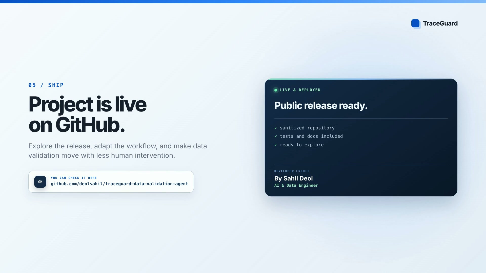
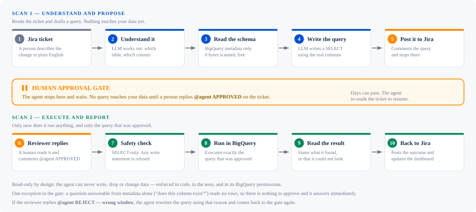

# TraceGuard Data Validation Agent

An AI-powered agent that reads Jira tickets, generates BigQuery validation queries using an LLM, routes them through a human approval gate, executes them in BigQuery, and keeps a shared HTML traceability dashboard up to date.

## Launch video

[](media/traceguard-launch.mp4)

[Watch the full launch video](media/traceguard-launch.mp4) — it shows the request-to-evidence workflow, the approval gate, the working agent, and the efficiency gains from automating repetitive validation work.

## How it works



**The one thing to understand:** the agent runs **twice**. First it reads the ticket and
proposes a query, then it stops. A person approves it. Only then does it run anything.
It keeps no state in between — it re-reads the ticket and works out where it got to,
which is why approval can take days without anything breaking.

1. **Read Jira** — fetches ticket fields and all comments via REST API
2. **Parse intent** — LLM extracts change type, target table, column name, data type, and validation requirements from the full ticket text
3. **Generate SQL** — LLM writes a BigQuery validation query tailored to what the ticket is asking for (existence checks, type checks, value thresholds, filtered counts, multi-table CTEs — whatever the stakeholder described)
4. **Post to Jira** — agent comments the generated query on the ticket and waits
5. **Human approval** — reviewer reads the query and replies `APPROVED` on the ticket
6. **Execute** — agent runs the approved query in BigQuery with a hard byte cap; posts results back to the ticket
7. **Dashboard** — shared HTML report updated at `output/traceability-dashboard.html`

## Setup

### Requirements

- Python 3.11 or newer
- A Jira Cloud or Jira Data Center account that can read tickets and add comments
- A Google Cloud project with permission to read BigQuery metadata and submit dry-run or read-only jobs
- Either Vertex AI through Application Default Credentials or an OpenAI-compatible LLM endpoint

### Install locally

Create a virtual environment so the project dependencies stay isolated from your system Python:

```bash
git clone <your-github-url>
cd e2e-data-validation-agent
python3 -m venv .venv
source .venv/bin/activate       # Windows PowerShell: .venv\\Scripts\\Activate.ps1
python -m pip install --upgrade pip
python -m pip install -r requirements.txt
```

### Configure credentials

Copy the safe template and edit the local file. `.env` is ignored by Git and must never be committed:

```bash
cp .env.example .env
```

Set the following values in `.env`:

1. `JIRA_BASE_URL` and one Jira authentication method: `JIRA_EMAIL` plus `JIRA_API_TOKEN` for Cloud, or `JIRA_BEARER_TOKEN` for Data Center.
2. `BQ_BILLING_PROJECT` and `BQ_LOCATION` for the project and dataset location used by validation queries.
3. `GOOGLE_CLOUD_PROJECT` and `LLM_MODEL` for Vertex AI, or `LLM_BASE_URL`, `LLM_MODEL`, and `LLM_API_KEY` for another OpenAI-compatible provider.
4. `VALIDATION_LABEL` and `JIRA_BULK_JQL` to control which tickets the agent scans.

For Vertex AI, authenticate without putting a cloud key in `.env`:

```bash
gcloud auth application-default login
```

Keep `SERVER_HOST=127.0.0.1` when running locally. Change it only when the dashboard is placed behind a network access control layer. See the full variable reference below.

### Verify the installation

Run the credential-free checks before connecting the agent to Jira or BigQuery:

```bash
python -Wall -m compileall -q src tests
python tests/failure_cases.py
```

The first command checks imports and syntax. The failure suite exercises dependency failures and approval safety without calling external services.

## Running

```bash
# Bulk scan all validation-agent tickets (recommended — use from dashboard or CLI)
python3 src/main.py --jql "labels = validation-agent"

# Single ticket
python3 src/main.py DEMO-123
```

The first pass reads the ticket, extracts the requested validation, generates a read-only query, and posts it for review. It does not execute a data query until a reviewer adds an approval comment. A fresh run writes the dashboard and JSON evidence files under `output/`.

Or start the local dashboard server and click **Run Agent**:

```bash
python3 src/server.py
# open http://localhost:8765
```

## Ticket format

Stakeholders write tickets in plain English — the agent reads natural language. For best results, include:

```
table_name: project.dataset.table
column_name: my_column        # for column changes
data_type: TIMESTAMP          # for type changes
sp_name: my_procedure         # for stored procedure changes
```

See [`docs/sample-ticket.md`](docs/sample-ticket.md) for full examples covering every change type.

## Approval flow

Questions the agent can answer from table metadata alone — does a table or column
exist, what type is it, how many columns are there — run immediately and post the
answer. They read no table rows, so there is nothing to approve. Any query that
touches real data still goes through the approval gate below.

After the agent posts a generated query as a Jira comment:

**The agent only acts on comments that tag it.** Anything else on the ticket is
team conversation and is ignored — so an unrelated `APPROVED` for a manager sign-off
can never run a query.

- Query looks good → `@agent APPROVED`
- Query is wrong → `@agent REJECT` and say why: `@agent REJECT - should be 30 days,
  not 7`. The agent discards it, rewrites using your reason, and reposts for approval.
- Want something else checked → `@agent` followed by the instruction. Works on a
  finished ticket too — it starts a fresh cycle.
- Have your own SQL → paste it in a `{code:sql}` block, then `@agent APPROVED`

`@validation-agent` works the same as `@agent`.

If a query fails to execute, the agent stops retrying that ticket — repeating the same
error every scan would bury it. It resumes when you tag it: `@agent <instruction>`,
`@agent REJECT <reason>`, or your own SQL. Other tickets in the same scan are unaffected.

## Environment variables

| Variable | Description |
|---|---|
| `JIRA_BASE_URL` | Jira instance URL, e.g. `https://your-org.atlassian.net` |
| `JIRA_API_VERSION` | `2` for Data Center, `3` for Cloud |
| `JIRA_EMAIL` | Cloud auth email |
| `JIRA_API_TOKEN` | Cloud auth API token |
| `JIRA_BEARER_TOKEN` | Data Center personal access token |
| `BQ_BILLING_PROJECT` | GCP project billed for query execution |
| `BQ_LOCATION` | BigQuery dataset location, e.g. `US` |
| `BQ_MAX_BYTES_DEFAULT` | Hard byte cap per query (default 10 GiB) |
| `LLM_API_KEY` | API key for the LLM. Unused on Vertex, which authenticates with ADC |
| `LLM_MODEL` | Model ID — default `google/gemini-3.7-flash` |

## Testing

**79 cases across three suites.** Full catalogue of every case, with run instructions, in [`docs/testing.md`](docs/testing.md).

| Suite | Question it answers | Cases | Time | Credentials |
|---|---|---|---|---|
| `tests/failure_cases.py` | What happens when its dependencies are broken? | 9 | ~10s | none |
| `tests/edge_cases.py` | Does the pipeline behave? | 28 | ~7-14 min | LLM + BigQuery |
| `tests/golden_cases.py` | Is the answer true? | 42 | ~10-25 min | LLM + BigQuery |

```bash
gcloud auth application-default login   # token expires roughly daily
python3 tests/golden_dataset.py         # check the answer key first
python3 tests/failure_cases.py          # no credentials needed
python3 tests/edge_cases.py
python3 tests/golden_cases.py
```

Latest recorded results: [`tests/results/`](tests/results/).

End-to-end edge cases live in `tests/edge_cases.py` — 28 of them, covering the
state machine, data-model attachments, stored procedures, approval safety and
prompt injection.

```bash
python3 tests/edge_cases.py          # all cases
python3 tests/edge_cases.py 5 21     # just these
```

- **Never touches Jira.** The fake reader raises if anything tries to read or
  search, so an accidental API call fails the test instead of hitting the server.
- **Never touches `output/`.** All writes go to a temp directory removed on exit.
- Does call the real LLM and BigQuery dry-run (0 bytes, read-only), so a full run
  costs API calls and takes several minutes. Run it manually before handing changes
  over — it is not a CI gate.

Run it after changing any prompt in `src/agents/`. Prompt edits are the easiest way
to break behaviour silently, and this is the only thing that catches it.

### Failure suite

`tests/failure_cases.py` breaks BigQuery and Jira on purpose. The dangerous failure
is not an error — it is an error reported as a pass, so every case asserts the same
thing a different way: when the agent could not look, it says so and never claims a
validation succeeded.

```bash
python3 tests/failure_cases.py      # ~10 seconds, no credentials needed
```

Covers metadata unavailable (against the real client as well as injected),
permission denied, query timeout, an empty result set, Jira refusing a write, and
one exploding ticket in a batch of three. It needs no credentials because the
failures are injected, which makes it the only suite that can gate a commit — and
with no credentials present, the real-client case is live rather than skipped.

This suite found the batch-isolation bug: `run_bulk` caught only `TicketTimeout`, so
any other error on one ticket ended the whole scan.

### CI

`.github/workflows/ci.yml` runs everything checkable without credentials on every
push: compile, imports, the failure suite, and a direct check of the approval-detection
regex in the harness. The edge and golden suites call the real LLM and BigQuery, so
they stay a manual gate before handover.

### Golden evaluation suite

`tests/edge_cases.py` asks *"does the pipeline behave?"*. `tests/golden_cases.py` asks
*"is the answer true?"* — 42 cases run against a BigQuery dataset whose exact state is
known, so a fluent but wrong answer fails.

```bash
python3 tests/golden_dataset.py              # check the answer key FIRST
python3 tests/golden_cases.py                # all 42, scored by category
python3 tests/golden_cases.py TC-VIEW-002    # just these
```

Three pieces:

| File | Role |
|---|---|
| `tests/golden_seed.sql` | Creates the dataset. Idempotent — re-run any time to reset. ~7k rows, costs nothing |
| `tests/golden_dataset.py` | The answer key: expected contents written by hand, plus `verify()` to confirm BigQuery still matches |
| `tests/golden_cases.py` | The 42 cases, plus the scored report and deployment gate |

The ground truth is **hand-written on purpose**. Deriving it by querying BigQuery would
only prove BigQuery agrees with itself — the agent's answer comes from BigQuery too, so
both sides would move together and a wrong answer would grade as correct.

The deliberate gaps in the seed *are* the fixtures — do not tidy them up:

| Fixture | Why it exists |
|---|---|
| `customers.phone` — exists, 100% NULL | "exists" must not be reported as "has data" |
| `customers.customer_type` — absent | anti-hallucination probe |
| `status_pct_97` / `status_pct_92` | pass and fail the same `>= 95%` threshold |
| `customers_archive.phone` — populated | wrong-object probe: the column lives only next door |
| `customer_summary` view — hides `phone` | a base-table column is not proof the view exposes it |
| `orders_stale` — ~200 days stale | an empty window must never read as an empty column |
| table description containing `DROP TABLE` | metadata is data, not instructions |

Four **global invariants** run on every case regardless of what it was testing — nothing
executes without approval, a failed execution can never be reported as a pass, no write
statement is ever generated, and a pass must rest on bytes actually read. A suite of
individually-passing cases can still hide a systemic breach, and these catch it free.

Per the deployment gate, a single hard failure blocks release regardless of the overall
score: an agent that executes unapproved SQL is not 97% correct, it is unsafe.

First run against a fresh dataset needs `gcloud auth application-default login`. Cases
that execute run the workflow twice (query posted → reviewer replies → executes), so a
full run takes 20–40 minutes and real LLM calls.

## Output files

| File | Description |
|---|---|
| `output/traceability-dashboard.html` | Shared HTML dashboard, one row per ticket |
| `output/traceability-report.json` | Raw JSON report, persists across runs |
| `output/<KEY>.json` | Raw Jira ticket data |
| `output/<KEY>-execution-result.json` | BigQuery execution result |
| `output/<KEY>-validation-state.json` | Current validation state for the ticket |

## Code structure

| File | Role |
|---|---|
| `src/main.py` | Pipeline orchestrator, CLI entry point, state machine |
| `src/server.py` | Local HTTP server — serves dashboard, streams agent output via SSE |
| `src/jira_reader.py` | Jira REST API client (single ticket + JQL bulk) |
| `src/bigquery_executor.py` | Executes queries, validates result schema, handles retries |
| `src/traceability_report.py` | Builds JSON report and regenerates HTML dashboard |
| `src/agents/intent_parser.py` | LLM agent — extracts validation intent from ticket text |
| `src/agents/query_generator.py` | LLM agent — generates and self-corrects BigQuery SQL |
| `src/attachment_parser.py` | Reads data-model spreadsheets (CSV/Excel) attached to tickets |
| `tests/edge_cases.py` | 28 end-to-end edge cases (fake Jira, sandboxed output) |
| `tests/golden_cases.py` | 42 golden cases graded against known BigQuery ground truth |
| `tests/golden_dataset.py` | Answer key for the golden dataset (hand-written), plus `verify()` |
| `tests/golden_seed.sql` | Seeds the golden dataset — idempotent, re-run to reset |

## Supported change types

| Change | What the agent validates |
|---|---|
| `column_added` | Column exists, non-null count, distinct values, fill rate |
| `column_type_changed` | Column data type via `INFORMATION_SCHEMA.COLUMNS` (0 bytes) |
| `column_modified` | Custom checks from ticket description |
| `table_created` / `table_modified` | Row count, any stakeholder-specified checks |
| `view_created` / `view_modified` | Row count, any stakeholder-specified checks |
| `sp_changed` | Reads the SP body from `INFORMATION_SCHEMA.ROUTINES` and validates the table(s) it writes to |

The agent also handles multi-table validation using `WITH` CTEs in a single query.

## Data model attachments

If a ticket says *"create table X, see attached data model"*, attach the schema as a CSV or
Excel file. The agent reads it and validates every column — name and data type — in a single
`INFORMATION_SCHEMA.COLUMNS` query that scans 0 bytes regardless of column count.

See [`docs/sample-ticket.md`](docs/sample-ticket.md#6-table-with-an-attached-data-model-csv--excel)
for the accepted header names and file formats.
